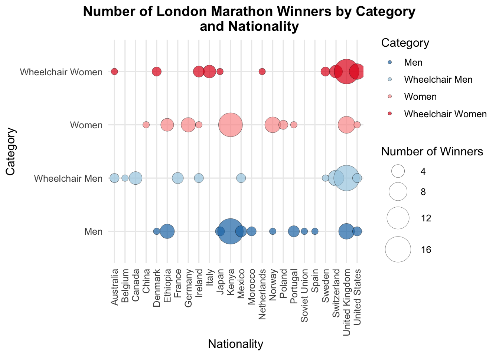
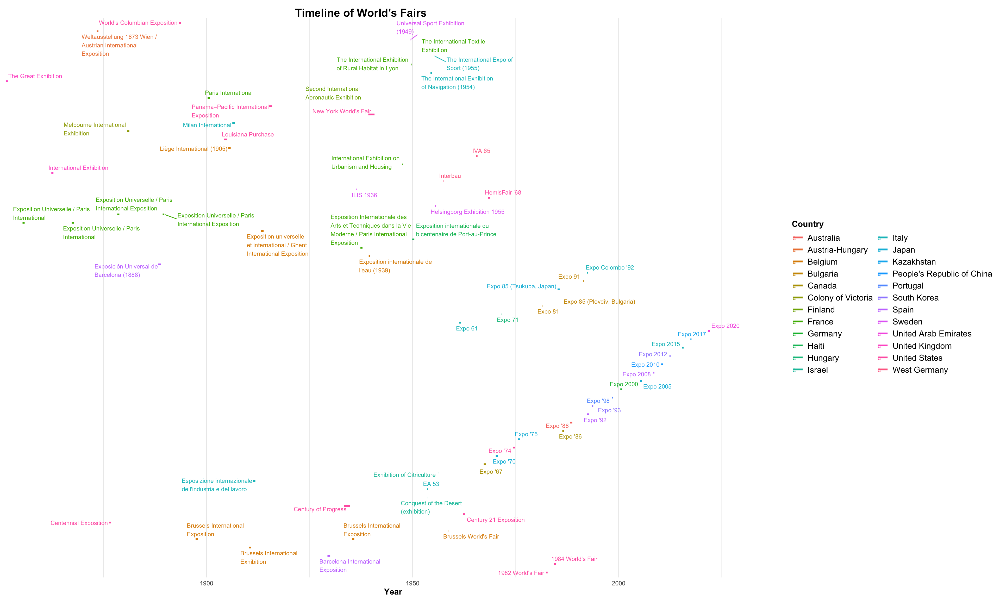
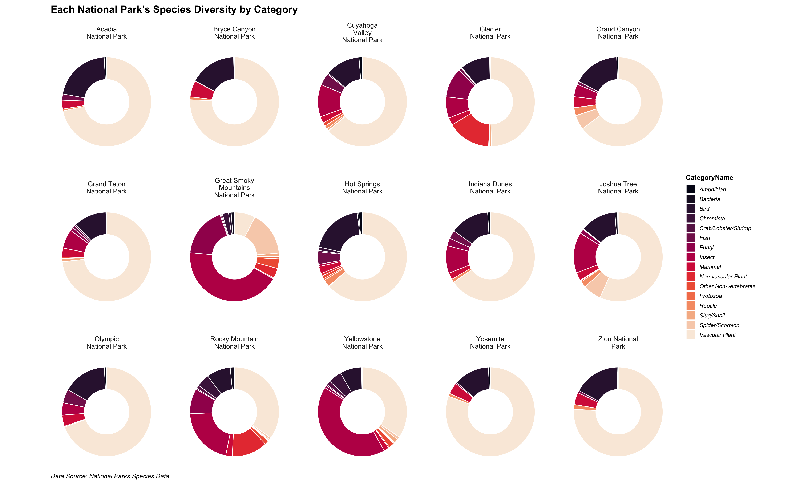
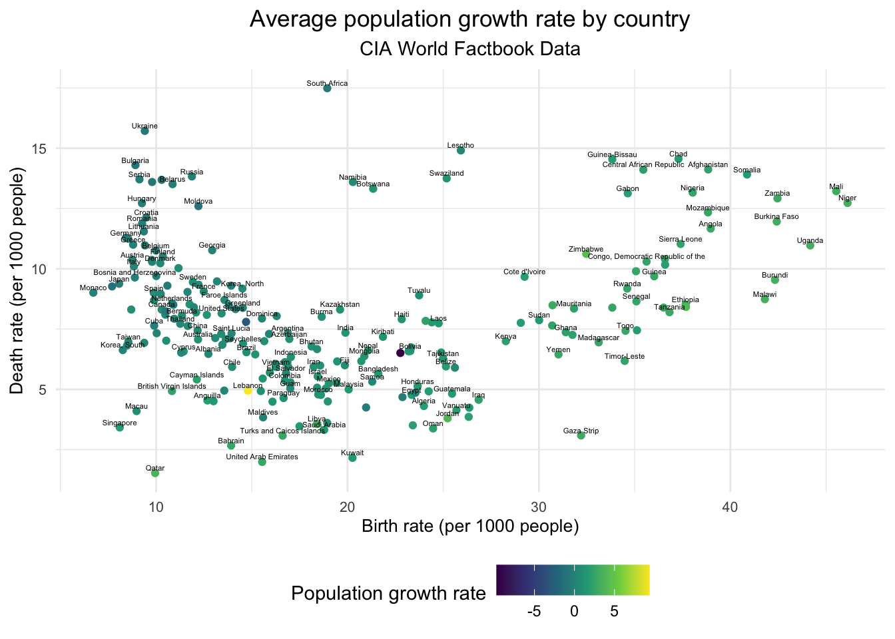

# Hanna's Collection of Data Viz Projects

 

> Here, you will find a collection of my data visualization projects. Each project is a separate folder containing the project's data, code, and output.

 

### TidyTuesday

The TidyTuesday projects are named in the YYYY-MM-DD format in which are the dates that the data set was published on the [TidyTuesday repo](https://github.com/rfordatascience/tidytuesday).  

The TidyTuesday project files will also start with *"TT"*.

### Personal Projects

My personal projects will not have a date in the name, and all related files will start with *"PP"* which stands for **p**ersonal **p**roject.  

 

 

###### *Clicking on the viz images will take you directly to its corresponding .qmd file.*

 

<!-- TABLE START -->

|  |  |  |  |
|------------------|------------------|-------------------|------------------|
| 2023-04-25 London Marathon Winners | 2024-08-13 UNESCO World Heritage Sites | 2024-10-08 National Parks Species Data | 2024-10-22 CIA World Factbook Data |
|  |  |  |  |

------------------------------------------------------------------------

<!-- TABLE END -->
